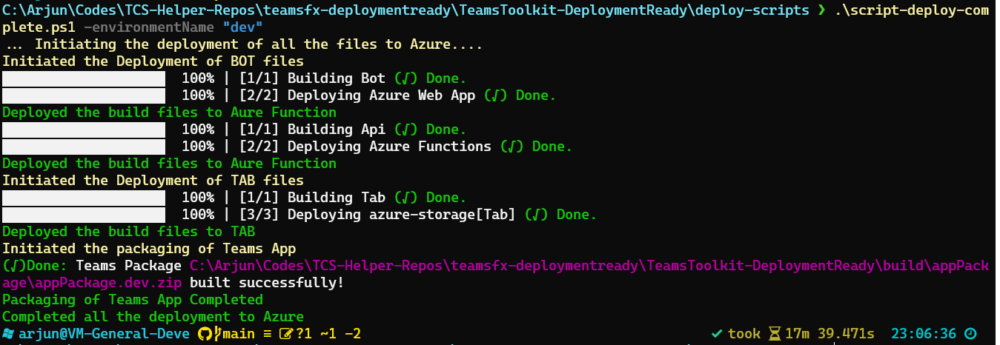

# Overview of the Deployable Teams Template

The objective of this repository is to provide a template for building a deployable Teams application. This respository has a folder named `deploy-scripts` which contains the scripts to deploy the application to Azure. The `deploy-scripts` folder contains the following files:

1. script-delete-all-buildfiles.ps1
2. script-deploy-azurefunction.ps1
3. script-deploy-bots.ps1
4. script-deploy-complete.ps1
5. script-deploy-tabs.ps1
6. script-get-toolkitRootfolder.ps1
7. script-package-teamsapp.ps1
8. script-provision-complete.ps1

If you are interested in knowing the purpose of each script, we have given detailed documentation along with the comments for you to underdstand the purpose of each script.

_Sample Script Screenshot_

## Get Started with the deployment

>
> ### Prerequisites
>
> To run the command bot template in your local dev machine, you will need:
>
> - `PowerShell` installed in the machine
> - `Node.js` installed locally (recommended version: 16)
> - `TeamsFx CLI` installed. Refer [here](https://learn.microsoft.com/en-us/microsoftteams/platform/toolkit/teamsfx-cli#get-started) for installing the TeamsFx CLI.
>
### Prepare for the transportation of the files for deployment

First step before the deployment would be to move the files from the Teams Toolkit folder from the development machine to machine from where the files will be deployed to Azure. For that, we need to ensure that only the required files need to be moved to the deployment server.
For doing that, you need to :

>**NOTE**
> It is recommended to push the files to Git / any source safe before doing the below steps so that none of the needed files are lost**

- Copy the complete folder `deploy-scripts` to the Teams Toolkit project folder which is there in the development machine
- Open `PowerShell` in the `deploy-scripts` folder.
- Execute the command `.\script-delete-all-buildfiles.ps1` to delete all the build files from the Teams Toolkit project folder.
- Once execution is complete, you will see a result like the one shown below:

- This will ensure that only needed files are remaining the Teams Toolkit project folder.
- Then zip the complete project folder and move the zip file to the deployment server.

### 1. Provision Azure resources

> **Note:**
> Ensure that you have [completed Preparation](#prepare-for-the-transportation-of-the-files-for-deployment) of Files section and have currently unzipped the file in the deployment server before the below steps

To provision Azure resources, follow the steps below

- Open `PowerShell` in the `deploy-scripts` folder
- Execute command `.\script-provision-complete.ps1 -environmentName "dev" -resourcegroupName "Teams-Dev-TCS"` where `environmentName` is the name of the environment and `resourcegroupName` is the name of the resource group.
- For the first time, you will be prompted to login to Azure. Follow the instructions to login to Azure.
- If login is succesful, the provisioning will start. The provisioning will take a few minutes to complete.
- Once provisioning is completed, you will be able to see the screen as shown below

### 2. Deploy resources

Next step which we need to do is to deploy the resources to Azure. We have created 2 ways of deploying. Either you can

[2.1 Deploy all resources at once](#21-deploy-all-resources-at-once)

2.2 Deploy resources individually

#### 2.1 Deploy all resources at once

To deploy all resources at once, follow the steps below

- Open `PowerShell` in the `deploy-scripts` folder
- Execute command `.\script-deploy-complete.ps1 -environmentName "dev"` where `environmentName` is the name of the environment.
- Status will be shown for each deployment and after each deployment, browser will open which will show the deployed resources.
- The script also will package the Teams App for the mentioned environment.
- Once complete deployment is done, you will be able to see the screen as shown below

