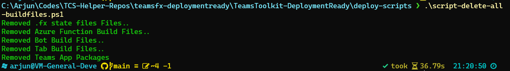
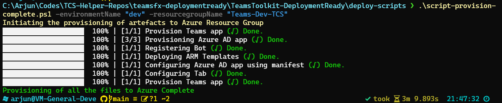

# Overview of the Deployable Teams Template

The objective of this repository is to provide a template for building a deployable Teams application. This respository has a folder named `deploy-scripts` which contains the scripts to deploy the application to Azure. The `deploy-scripts` folder contains the following files:

1. script-delete-all-buildfiles.ps1
2. script-deploy-azurefunction.ps1
3. script-deploy-bots.ps1
4. script-deploy-complete.ps1
5. script-deploy-tabs.ps1
6. script-get-toolkitRootfolder.ps1
7. script-package-teamsapp.ps1
8. script-provision-complete.ps1

## Get Started with the deployment

>
> ### Prerequisites
>
> To run the command bot template in your local dev machine, you will need:
>
> - `PowerShell` installed in the machine
> - `Node.js` installed locally (recommended version: 16)
> - `TeamsFx CLI` installed. Refer [here](https://learn.microsoft.com/en-us/microsoftteams/platform/toolkit/teamsfx-cli#get-started) for installing the TeamsFx CLI.
>
### Prepare for the transportation of the files for deployment

First step before the deployment would be to move the files from the Teams Toolkit folder from the development machine to machine from where the files will be deployed to Azure. For that, we need to ensure that only the required files need to be moved to the deployment server.
For doing that, you need to :

>**NOTE**
> It is recommended to push the files to Git / any source safe before doing the below steps so that none of the needed files are lost**

- Copy the complete folder `deploy-scripts` to the Teams Toolkit project folder which is there in the development machine
- Open `PowerShell` in the `deploy-scripts` folder.
- Execute the command `.\script-delete-all-buildfiles.ps1` to delete all the build files from the Teams Toolkit project folder.
- Once execution is complete, you will see a result like the one shown below:



- This will ensure that only needed files are remaining the Teams Toolkit project folder.
- Then zip the complete project folder and move the zip file to the deployment server.

### 1. Provision Azure resources

> **Note:**
> Ensure that you have [completed Preparation](#prepare-for-the-transportation-of-the-files-for-deployment) of Files section and have currently unzipped the file in the deployment server before the below steps

To provision Azure resources, follow the steps below

- Open `PowerShell` in the `deploy-scripts` folder
- Execute command `.\script-provision-complete.ps1 -environmentName "dev" -resourcegroupName "Teams-Dev-TCS"` where `environmentName` is the name of the environment and `resourcegroupName` is the name of the resource group.
- For the first time, you will be prompted to login to Azure. Follow the instructions to login to Azure.
- If login is succesful, the provisioning will start. The provisioning will take a few minutes to complete.
- Once provisioning is completed, you will be able to see the screen as shown below



```bash

1. First, select the Teams Toolkit icon on the left in the VS Code toolbar.
2. In the Account section, sign in with your [Microsoft 365 account](https://docs.microsoft.com/microsoftteams/platform/toolkit/accounts) if you haven't already.
3. Press F5 to start debugging which launches your app in Teams using a web browser. Select `Debug (Edge)` or `Debug (Chrome)`.
4. When Teams launches in the browser, select the Add button in the dialog to install your app to Teams.
5. Type or select `helloWorld` in the chat to send it to your bot - this is the default command provided by the template.

The bot will respond to the `helloWorld` command with an Adaptive Card:


## What's included in the template

| Folder | Contents |
| - | - |
| `.fx` | Project level settings, configurations, and environment information |
| `.vscode` | VSCode files for local debug |
| `bot` | The source code for the command and response Teams application |
| `templates` | Templates for the Teams application manifest and for provisioning Azure resources |

The following files can be customized and demonstrate an example implementation to get you started.

| File | Contents |
| - | - |
| `src/index.ts` | Application entry point and `restify` handlers for command and response |
| `src/adaptiveCards/helloworldCommand.json` | A generated Adaptive Card that is sent to Teams |
| `src/helloworldCommandHandler.ts` | The business logic to handle a command |
| `src/cardModels.ts` | The default Adaptive Card data model |

## Extend the command bot template with more commands and responses

Follow the steps below to add more commands and responses to extend the command bot:

1. [Step 1: Add a command definition in manifest](#step-1-add-a-command-definition-in-manifest)
2. [Step 2: Respond with an Adaptive Card](#step-2-respond-with-an-adaptive-card)
3. [Step 3: Handle the command](#step-3-handle-the-command)
4. [Step 4: Register the new command](#step-4-register-the-new-command)

### Step 1: Add a command definition in manifest

You can edit the manifest template file `templates\appPackage\manifest.template.json` to include definitions of a `doSomething` command with its title and description in the `commands` array:

```json
"commandLists": [
  {
    "commands": [
        {
            "title": "helloWorld",
            "description": "A helloworld command to send a welcome message"
        },
        {
            "title": "doSomething",
            "description": "A sample do something command"
        }
    ]
  }
]
```

### Step 2: Respond with an Adaptive Card

To respond with an Adaptive Card, define your card in its JSON format. Create a new file `src/adaptiveCards/doSomethingCommandResponse.json`:

```json
{
    "type": "AdaptiveCard",
    "body": [
        {
            "type": "TextBlock",
            "size": "Medium",
            "weight": "Bolder",
            "text": "Your doSomething Command is added!"
        },
        {
            "type": "TextBlock",
            "text": "Congratulations! Your hello world bot now includes a new DoSomething Command",
            "wrap": true
        }
    ],
    "$schema": "http://adaptivecards.io/schemas/adaptive-card.json",
    "version": "1.4"
}
```

You can use the [Adaptive Card Designer](https://adaptivecards.io/designer/) to help visually design your Adaptive Card UI.

> Please note:

> - Respond with an Adaptive Card is optional, you can simply respond with plain texts.
> - If you'd like to send adaptive card with dynamic data, please refer to [this document](https://aka.ms/teamsfx-command-response#how-to-build-command-response-using-adaptive-card-with-dynamic-content).

### Step 3: Handle the command

The TeamsFx SDK provides a convenient class, `TeamsFxBotCommandHandler`, to handle when an command is triggered from Teams conversation message. Create a new file, `bot/src/doSomethingCommandHandler.ts`:

```typescript
import { Activity, CardFactory, MessageFactory, TurnContext } from "botbuilder";
import { CommandMessage, TeamsFxBotCommandHandler, TriggerPatterns, MessageBuilder, } from "@microsoft/teamsfx";
import doSomethingCard  from "./adaptiveCards/doSomethingCommandResponse.json";
import { AdaptiveCards } from "@microsoft/adaptivecards-tools";
import { CardData } from "./cardModels";

export class DoSomethingCommandHandler implements TeamsFxBotCommandHandler {
    triggerPatterns: TriggerPatterns = "doSomething";

    async handleCommandReceived(
        context: TurnContext,
        message: CommandMessage
    ): Promise<string | Partial<Activity>> {
        // verify the command arguments which are received from the client if needed.
        console.log(`Bot received message: ${message.text}`);

        const cardData: CardData = {
          title: "doSomething command is added",
          body: "Congratulations! You have responded to doSomething command",
        };

        const cardJson = AdaptiveCards.declare(doSomethingCard).render(cardData);
        return MessageFactory.attachment(CardFactory.adaptiveCard(cardJson));
    }    
}

```

You can customize what the command does here, including calling an API, process data, etc.

### Step 4: Register the new command

Each new command needs to be configured in the `ConversationBot`, which powers the conversational flow of the command bot template. Navigate to the `bot/src/internal/initialize.ts` file and update the `commands` array of the `command` property:

```typescript
import { HelloWorldCommandHandler } from "../helloworldCommandHandler";
import { DoSomethingCommandHandler } from "../doSomethingCommandHandler";
import { ConversationBot } from "@microsoft/teamsfx";

const commandBot = new ConversationBot({
    //...
    command: {
        enabled: true,
        commands: [ 
            new HelloWorldCommandHandler(), 
            new DoSomethingCommandHandler() ],
    },
});
```

Congratulations, you've just created your own command! To learn more about the command bot template, [visit the documentation on GitHub](https://aka.ms/teamsfx-command-response). You can find more scenarios like:

- [Customize the trigger pattern](https://aka.ms/teamsfx-command-response#customize-the-trigger-pattern)
- [Customize the Adaptive Card with dynamic content](https://aka.ms/teamsfx-command-response#how-to-build-command-response-using-adaptive-card-with-dynamic-content)
- [Change the way to initialize the bot](https://aka.ms/teamsfx-command-response#customize-initialization)
- [Connect to an existing API](https://aka.ms/teamsfx-command-response#connect-to-existing-api)
- [Access Microsoft Graph](https://aka.ms/teamsfx-add-sso)

## Extend command bot with other bot scenarios

Command bot is compatible with other bot scenarios like notification bot and workflow bot.

### Add notifications to your command bot

The notification feature adds the ability for your application to send Adaptive Cards in response to external events. Follow the [steps here](https://aka.ms/teamsfx-command-response#how-to-extend-my-command-and-response-bot-to-support-notification) to add the notification feature to your command bot. Refer [the notification document](https://aka.ms/teamsfx-notification) for more information.

### Add workflow to your command bot

Adaptive cards can be updated on user action to allow user progress through a series of cards that require user input. Developers can define actions and use a bot to return an Adaptive Cards in response to user action. This can be chained into sequential workflows. Follow the [steps here](https://aka.ms/teamsfx-card-action-response#add-more-card-actions) to add workflow feature to your command bot. Refer [the workflow document](https://aka.ms/teamsfx-card-action-response) for more information.

## Additional information and references

- [Manage multiple environments](https://docs.microsoft.com/microsoftteams/platform/toolkit/teamsfx-multi-env)
- [Collaborate with others](https://docs.microsoft.com/microsoftteams/platform/toolkit/teamsfx-collaboration)
- [Teams Toolkit Documentations](https://docs.microsoft.com/microsoftteams/platform/toolkit/teams-toolkit-fundamentals)
- [Teams Toolkit CLI](https://docs.microsoft.com/microsoftteams/platform/toolkit/teamsfx-cli)
- [TeamsFx SDK](https://docs.microsoft.com/microsoftteams/platform/toolkit/teamsfx-sdk)
- [Teams Toolkit Samples](https://github.com/OfficeDev/TeamsFx-Samples)
